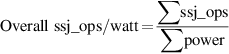

# 1.10 把它们放在一起：性能、价格和功耗

在每一章结尾处的 "把它放在一起 "部分，我们提供了使用该章原则的真实例子。在本节中，我们使用SPECpower基准测试来衡量小型服务器的功耗-性能对比。

图1.20显示了我们评估的三种多处理器服务器及其价格。为了保持价格比较的公平性，都是戴尔PowerEdge服务器。第一个是PowerEdge R710，它基于Intel Xeon ×85670微处理器，时钟频率为2.93GHz。与第[2](../di-er-zhang-nei-cun-ceng-ci-jie-gou-she-ji.md)-[5](../di-wu-zhang-xian-cheng-ji-bing-hang.md)章中的英特尔Core i7-6700 不同，它有20个核和40MB的L3缓存，Xeon ×85670有22个内核和55MB的L3缓存，尽管核本身是相同的。对于服务器，我们选择了一个双插槽系统--所以总共有44个核心--有128GB的ECC保护的2400MHz DDR4 DRAM。下一台服务器是PowerEdge C630，具有相同的处理器、插座数量和DRAM。主要的区别是采用了更小的机架式封装：730的 "2U "高（3.5英寸），而630的 "1U"（1.75英寸）。第三台服务器是一个由16台PowerEdge 630组成的集群，用一个1Gbit/s以太网交换机连接在一起。所有服务器都运行Oracle Java HotSpot 1.7版Java虚拟机（JVM）和微软Windows Server 2012 R2 Datacenter 6.3版操作系统。

请注意，由于只需要跑基准测试（见第1.11节），这些是不太常见的服务器配置。图1.20中的系统相对于计算量来说内存很少，只有一个很小的120GB固态硬盘。如果你不需要增加相应的内存和存储空间，那么增加CPU核的成本是很低的。

SPECpower不是运行SPEC CPU的静态链接C程序，而是使用一个用Java编写的更现代的软件栈。它以SPECjbb为基础，代表商业应用的服务器端，性能以每秒的交易数来衡量，称为ssj\_ops，代表服务器端每秒的Java操作。它不仅测验了服务器的处理器，就像SPEC CPU一样，还测验了缓存、内存系统，甚至是多处理器的互连系统。此外，它还也测验了JVM，包括JIT运行时编译器和垃圾收集器，以及底层操作系统的部分。

如图1.20的最后两行所示，性能上的赢家是16台R630的集群，这并不令人惊讶，因为它是最昂贵的。价格-性能的赢家是PowerEdge R630，但它勉强击败了集群，价格是213比211 ssj-ops每美元。令人惊讶的是，16个节点的集群尽管是单节点的16倍大，但其价格-性能比却在1%以内。

虽然大多数基准（和大多数计算机架构设计者）只关心系统在峰值负载下的性能，但计算机很少在峰值负载下运行。事实上，第6章中的图6.2显示了谷歌公司6个月来对数万台服务器的利用率进行测量的结果，只有不到1%的服务器在平均利用率为100%的情况下运行。大多数服务器的平均利用率在10%到50%之间。因此，SPECpower基准捕捉到了目标工作负载从10%的峰值一直到0%的功率变化，这被称为主动闲置。

图1.21描绘了每瓦特的ssj\_ops（SSJ操作/秒）以及目标负载从100%到0%变化时的平均功率。英特尔R730总是有最低的功率，而单节点R630在每个目标工作负载水平上都有最好的每瓦特ssj\_ops。由于瓦特=焦耳/秒，这个指标与每焦耳的SSJ操作成正比：​

SPECpower使用一个单一的值，用于比较系统的功率性能比：

三台服务器的总体ssj\_ops/watt为：R730为10,802，R630为11,157，16台R630组成的集群为10,062。因此，单节点的R630具有最佳的功率性能比。除以服务器的价格，ssj\_ops/watt/$1,000，R730为879，R630为899，16个节点的R630集群为789（每个节点）。因此，在增加功率后，单节点的R630在性能/价格方面仍然排在第一位，但现在单节点的R730的效率明显高于16节点的集群。
