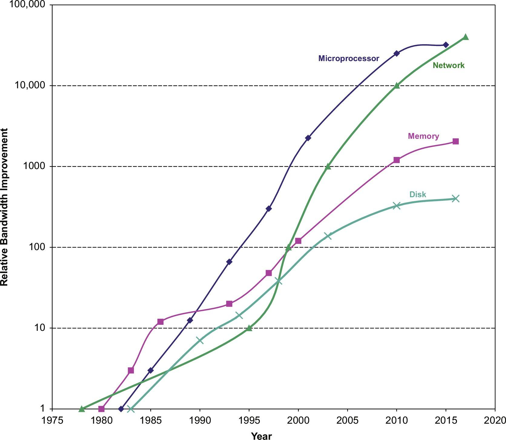
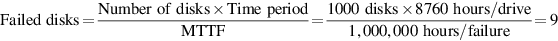

# 1.11 谬误和陷阱

本节将在每一章中出现，目的是解释一些你应该避免的普遍存在的错误观念或误解。我们把这种误信称为谬误。在讨论一个谬误时，我们试图给出一个反例。我们也讨论陷阱--容易犯的错误。通常情况下，陷阱是对原则的概括，而这些原则在有限的背景下是真实的。这些章节的目的是帮助你避免在你设计的计算机中犯这些错误。

**陷阱** _所有的指数规律都将应验。_

第一个被淘汰的是Dennard定律。Dennard在1974年的观察是，随着晶体管变小，功率密度是不变的。如果一个晶体管的线性区域缩小了2倍，那么电流和电压也减少了2倍，因此它使用的功率下降了4倍。Dennard定律在被观察到30年后结束了，不是因为晶体管没有继续变小，而是因为集成电路的可靠性限制了电流和电压可以下降的程度。阈值电压被驱动得如此之低，以至于静态功率成为总功率的一个重要部分。&#x20;

下一个例子是硬盘驱动器。虽然磁盘没有规律可循，但在过去30年中，硬盘的最大面积密度--它决定了磁盘容量--每年提高30%-100%。在最近几年里，每年的增长率低于5%。每块硬盘密度的提高主要来自于在硬盘上增加更多的盘片。&#x20;

接下来是古老的摩尔定律。自从每块芯片的晶体管数量每隔一到两年就翻一番以来，已经有一段时间了。例如，2014年推出的DRAM芯片包含80亿个晶体管，直到2019年我们才会有160亿个晶体管的DRAM芯片投入量产。但如果按照摩尔定律的预测，那将会有640亿个晶体管的DRAM芯片。&#x20;

此外，平面逻辑晶体管数目的实际扩张的结束甚至被预测为到2021年。图1.22显示了两版《国际半导体技术路线图》（ITRS）对逻辑晶体管门长度的预测。与2013年报告预测到2028年栅极长度将达到5纳米不同，2015年报告预测到2021年长度停止在10纳米。此后的密度改进将不得不来自缩小晶体管尺寸以外的其他方式。这并不像ITRS建议的那样可怕，因为像英特尔和台积电这样的公司已经计划将逻辑门长度缩小到3纳米，但是变化的速度正在下降。

图1.23显示了微处理器和DRAM--它们受到Dennard定律的结束和摩尔定律的影响--以及磁盘的带宽随时间增长的变化。技术改进的放缓在下降的曲线中很明显。网络的持续改进是由于光纤的进步和脉冲振幅调制（PAM-4）的计划改变，允许两比特编码，以便以400Gbit/s的速度传输信息。

**谬论** _多核处理器是银弹。_

2005年左右转向每片多处理器并不是因为有什么突破，大大简化了并行编程或使建立多核计算机变得容易。发生这种变化是因为由于ILP墙和功率墙的存在，没有其他选择。每个芯片上的多个处理器并不能保证更低的功率；设计一个使用更高功率的多核芯片当然是可行的。潜力只是有可能通过用几个较低时钟频率的高效内核取代一个高时钟频率的低效内核来继续提高性能。随着缩小晶体管的技术改进，它可以将电容和电源电压都缩小一些，这样我们就可以在每一代的内核数量上得到适度的增加。例如，在过去的几年里，英特尔在他们的高端芯片中每一代都会增加两个内核。 正如我们将在第4章和第5章中看到的，性能提升现在是程序员的工作。程序员依靠硬件设计者来使他们的程序更快，而不用动一根手指的La-Z-Boy时代已经正式结束了。如果程序员希望他们的程序每一代都能更快，他们必须使他们的程序更加并行。 摩尔定律的流行版本--随着每一代技术的发展而提高性能--现在由程序员决定了。

**陷阱** _沦为阿姆达尔“心碎”定律的牺牲品。_

几乎每个从业的计算机架构设计者都知道阿姆达尔定律。尽管如此，我们几乎都会在测量其使用情况之前，偶尔花费巨大的精力来优化某些功能。只有当整体的速度提升令人失望时，我们才会想起，在我们花了这么多精力来提升它之前，我们应该先测量一下它！

**陷阱** _单点故障。_

[1.7节](1.7-ke-kao-xing.md)使用阿姆达尔定律进行的可靠性改进的计算表明，可靠性不会比链条中最弱的一环更强。无论我们如何提高电源的可靠性，正如我们在例子中所做的那样，单个风扇将限制磁盘子系统的可靠性。这个阿姆达尔定律的观察导致了一个容错系统的经验法则，即确保每一个组件都是冗余的，这样就没有一个组件的故障会使整个系统崩溃。[第六章](../di-liu-zhang-da-gui-mo-shu-ju-zhong-xin-ji-ji-suan-ji-de-bing-hang-xing-qing-qiu-ji-bing-hang-rlp-he.md)展示了软件层如何避免WSCs内部的单点故障。

**谬论** _改进硬件的性能也会提高能效，或者在最坏的情况下是能耗不增加也不减少。_

Esmaeilzadeh等人（2011年）使用Turbo模式（第1.5节）在2.67GHz英特尔酷睿i7的一个核心上测量了SPEC2006。当时钟频率提高到2.94GHz时，性能提高了1.07倍（或1.10倍），但i7增加了1.37倍功耗和1.47倍的能耗！。

**谬误** _基准永远有效_。

有几个因素影响了基准作为实际性能预测的有用性，而且有些因素会随着时间的推移而改变。一个重要的事实是，基准有用性本身与 "基准标准化 "或 "基准流行化 "的趋势相抵触。一旦一个基准变得标准和流行，就会有巨大的压力，使得设计者通过有针对性的优化或对运行基准的规则进行大量分析来提高性能。当设计小kernel或程序将时间花在一小段代码上时，这将对基准的有用性产生消极影响。 例如，尽管有最好的意图，最初的SPEC89基准套件包括一个小kernel，称为matrix300，它由8个不同的300×300矩阵乘法组成。在这个kernel，99%的执行时间都在一行中（见SPEC，1989）。当IBM的一个编译器对这个内循环进行优化时（使用一个叫做blocking的好策略，将在[第二章](../di-er-zhang-nei-cun-ceng-ci-jie-gou-she-ji.md)和[第四章](../di-si-zhang-shi-liang-simd-he-gpu-jia-gou-zhong-de-shu-ju-ji-bing-hang-xing.md)中讨论），性能比之前版本的编译器提高了9倍！这个基准测试的这个编译器优化，当然不是整体性能的良好表征，也不是这个特定优化的价值所在。&#x20;

图1.19表明，如果我们忽视历史，我们可能会被迫重复它。SPEC Cint2006已经有十年没有更新了，这给了编译器编写者大量的时间来磨练他们的优化器以适应这个套件。请注意，除了libquantum之外，所有基准的SPECRate都在AMD计算机的16-52范围内，而英特尔则在22-78之间。Libquantum在AMD上的运行速度约为250倍，在英特尔上为7300倍! 这个 "奇迹 "是英特尔编译器优化的结果，该编译器自动将代码在22个核心上并行化，并通过使用比特打包（bit packing）优化内存，将多个短整型（narrow-range integers）打包在一起，以节省内存空间，从而节省内存带宽。如果我们放弃这个基准并重新计算几何平均值，AMD SPEC Cint2006从31.9下降到26.5，英特尔从63.7下降到41.4。现在英特尔计算机的速度大约是AMD计算机的1.5倍，而不是2.0倍，如果我们包括libquantum，这肯定更接近他们的真实相对性能。SPECCPU2017放弃了libquantum。&#x20;

为了说明基准的短命，图1.17列出了各个SPEC版本中所有82个基准的状态；gcc是SPEC89中唯一的幸存者。令人惊讶的是，SPEC2000或更早的所有程序中，约有70%从下一个版本中被放弃。

**谬误** _磁盘的额定平均故障时间为120万小时，即近140年，所以磁盘实际上从未发生故障。_

目前磁盘制造商的市场营销会误导用户。MTTF是如何计算的呢？首先，制造商会把成千上万的磁盘放在一个房间里，运行几个月，然后统计故障磁盘的数量。MTTF由磁盘累计工作的总时长除以故障的数量得出。

一个问题是，这个数字远远超过了磁盘的使用寿命，通常假设为五年或43800小时。为了使这个大MTTF有一定的意义，磁盘制造商争辩说，这个统计模型可以这样解释：对应于一个购买磁盘的用户，然后按照计划寿命，每5年更换一次磁盘。他们声称，如果许多客户（以及他们的曾孙）在下个世纪都这样做的话，按照平均统计，他们会在发生故障前更换27次磁盘，或者大约140年。

一个更有用的衡量标准是磁盘故障的百分比，这被称为年故障率。假设1000个磁盘的MTTF为100万小时，并且这些磁盘每天使用24小时。如果你用具有相同可靠性特征的新磁盘替换失效的磁盘，一年内（8760小时）失效的数量为：

换句话说，每年有0.9%的故障，或在5年的使用寿命内有4.4%会发生故障。 此外，这个低故障率是在假设有限的温度和振动范围的情况下成立。如果超过了这些范围，那么所有的假设都会失效。一项对实际环境中的磁盘驱动器的调查（Gray和van Ingen，2005）发现，每年有3%-7%的驱动器发生故障，MTTF约为125,000-300,000小时。一项更大的研究发现，每年磁盘故障率为2%-10%（Pinheiro等人，2007）。因此，现实世界的MTTF大约比制造商的MTTF差2-10倍。

**谬误** _峰值性能反映了观测性能（observed performance，译者注：这里应该指的是计算机实际运行的真实性能）_。

峰值性能的唯一普遍正确的定义是 "一台计算机绝不可能超过的性能水平"。图 1.24 显示了四个程序在四个多核处理器上的峰值性能百分比。它从5%到58%不等。由于差距如此之大，而且不同的基准会有很大的不同，所以峰值性能一般对预测观测性能没有用。

**陷阱** _故障检测会降低可用度。_

这个明显具有讽刺意味的陷阱是因为计算机硬件有相当多的状态，这些状态可能并不总是对正常运行至关重要。例如，如果分支预测器发生错误，并不是致命的，因为只会对性能产生影响。&#x20;

在试图积极利用ILP的处理器中，并非所有的操作都是正确执行程序所需要的。Mukherjee等人（2003）发现，在SPEC2000基准测试中，只有不到30%的操作可能在关键路径上。 对程序的观测也是如此。如果一个寄存器在程序中是 "死的"，即程序再次读取它之前会先写入（译者注：写后读），那么错误就不重要了。但是，如果你在检测一个死寄存器瞬时故障时使程序崩溃，这将不必要地降低可用性。&#x20;

甲骨文公司的Sun Microsystems部门在2000年的Sun E3000到Sun E10000系统中使用了包括奇偶校验但不包括纠错的L2高速缓存，掉入了这个陷阱。他们用来建立高速缓存的SRAM有间歇性故障，而奇偶校验可以检测到这些故障。如果高速缓存中的数据没有被修改，处理器就会简单地从高速缓存中重新读取数据。由于设计者没有用ECC（Error-Correcting Code，纠错码）保护缓存，操作系统别无选择，只能将脏数据报告为错误，使程序崩溃。虽然现场工程师在检查中发现90%以上的情况没有问题。&#x20;

为了减少这种错误的发生频率，Sun公司修改了Solaris操作系统，通过有一个主动将脏数据写入内存的进程来 "刷洗 "缓存。因为处理器没有足够的引脚来添加ECC，所以对于脏数据的唯一硬件选择是复制外部缓存，使用没有奇偶性错误的副本来纠正错误。 陷阱在于检测故障而不提供纠正故障的机制。经历了这些，甲骨文公司的工程师们不太可能犯同样的错误，以至于再设计出一台在外部高速缓存上没有ECC的计算机。

