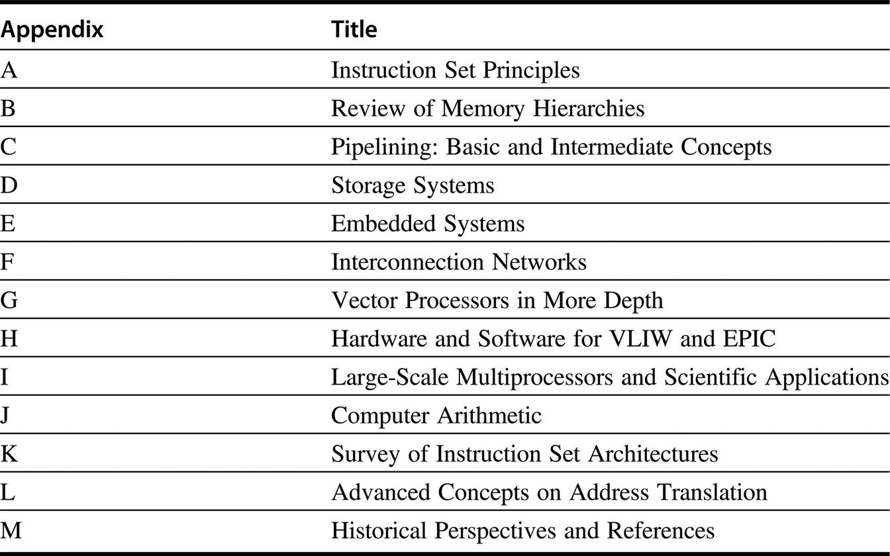

# 1.12 结论

本章介绍了一些概念，并提供了一个量化分析框架，我们将在全书中展开。从上一版开始，能效是性能的永恒伴侣。

在[第二章](../di-er-zhang-nei-cun-ceng-ci-jie-gou-she-ji.md)中，我们从内存系统设计这个最重要的领域开始。我们将研究一系列的技术，这些技术的综合应用使得内存看起来无限大，同时又尽可能地快。([附录B](../fu-lubnei-cun-ceng-ci-jie-gou-de-hui-gu/)为没有太多经验和背景的读者提供了关于缓存的介绍性材料）。在后面的章节中，我们将看到硬件和软件的合作已经成为高性能内存系统的关键，就像它对高性能流水线一样。本章还包括虚拟机，这是一种越来越重要的保护技术。

在[第三章](../di-san-zhang-zhi-ling-ji-bing-hang-ji-qi-ying-yong.md)中，我们研究ILP，其中流水线是最简单和最常见的形式。利用ILP是构建高速单处理器的最重要技术之一。[第三章](../di-san-zhang-zhi-ling-ji-bing-hang-ji-qi-ying-yong.md)首先对基本概念进行了广泛的讨论，使你为这两章所研究的广泛思想做好准备。[第三章](../di-san-zhang-zhi-ling-ji-bing-hang-ji-qi-ying-yong.md)使用的例子横跨约40年，从最早的超级计算机之一（IBM 360/91）到2017年市场上最快的处理器。它强调了所谓的利用ILP的动态或运行时方法。它还谈到了ILP思想的局限性，并介绍了多线程，这在[第四章](../di-si-zhang-shi-liang-simd-he-gpu-jia-gou-zhong-de-shu-ju-ji-bing-hang-xing.md)和[第五章](../di-wu-zhang-xian-cheng-ji-bing-hang.md)都有进一步的展开。[附录C](../fu-lucliu-shui-xian-chu-ji-he-zhong-ji-gai-nian.md)为没有很多流水线经验和背景的读者提供了关于流水线的介绍性材料。(我们希望它能成为许多读者的复习资料，包括那些我们的介绍性课本《计算机组织与设计：硬件/软件接口》的读者）。

[第四章](../di-si-zhang-shi-liang-simd-he-gpu-jia-gou-zhong-de-shu-ju-ji-bing-hang-xing.md)解释了利用数据级并行的三种方法。最经典和历史悠久的方法是矢量结构，我们从这里开始，奠定SIMD设计的原则。([附录G](../fu-lugshen-ru-xiang-liang-chu-li-qi.md)对矢量结构进行了更深入的研究。)接下来我们将解释当今大多数台式微处理器中的SIMD指令集扩展。第三部分是对现代图形处理单元（GPU）如何工作的深入解释。大多数GPU的描述都是从程序员的角度写的，这通常掩盖了计算机的真正工作原理。这一部分从内部人士的角度解释GPU，包括GPU术语和更传统的架构术语之间的对应关系。

[第五章](../di-wu-zhang-xian-cheng-ji-bing-hang.md)重点讨论了使用多处理器（multiprocessors）实现更高的性能问题。多处理器不是使用并行性来重叠单个指令，而是使用并行性来允许多个指令流在不同处理器上同时执行。我们的重点是多处理器的主要形式，即共享内存多处理器（shared-memory multiprocessors）。尽管我们也介绍其他类型，并讨论了多处理器中出现的广泛问题。这里我们将再次探讨各种技术，重点是 20 世纪 80 年代和 90 年代首次提出的重要观点。

[第六章](../di-liu-zhang-da-gui-mo-shu-ju-zhong-xin-ji-ji-suan-ji-de-bing-hang-xing-qing-qiu-ji-bing-hang-rlp-he.md)介绍了集群，然后深入探讨了计算机架构设计者帮助设计的WSCs。WSCs的设计者是超级计算机先驱的继任者，如Seymour Cray，因为他们正在设计这样的特殊计算机：包含数以万计的服务器，设备和容纳它们的建筑耗资近2亿美元。前面几章所关注的性价比和能源效率问题适用于WSCs，量化的决策方法也适用于WSCs。

[第七章](../di-qi-zhang-ling-yu-te-ding-jia-gou-dsa.md)是本版的新内容。它介绍了特定领域的架构，鉴于摩尔定律和Dennard定律的结束，这是提高性能和能源效率的唯一途径。它提供了如何构建有效的特定领域架构的指南，介绍了令人兴奋的深度神经网络领域，描述了最近的四个例子，它们采取了非常不同的方法来加速神经网络，并比较了它们的性价比。

本书在网上附带了大量的材料（详见前言），既是为了降低成本，也是为了向读者介绍各种高级课题。图1.25显示了它们的全部内容。书中出现的[附录A](../fu-luazhi-ling-ji-she-ji-yuan-ze.md)-[C](../fu-lucliu-shui-xian-chu-ji-he-zhong-ji-gai-nian.md)将成为许多读者的回顾。

在[附录D](../fu-ludcun-chu-xi-tong.md)中，我们将讨论重点从处理器转移到存储系统的问题。我们采用了一种类似的量化分析方法，但这种方法是基于对系统行为的观察，并使用端到端的方法进行性能分析。本附录讨论了如何利用成本较低的磁性存储技术有效地存储和检索数据这一重要问题。我们的重点是研究典型的I/O密集型工作负载的磁盘存储系统的性能，例如本章中提到的OLTP基准测试。我们广泛地探讨了基于RAID的系统的高级主题，该系统使用冗余磁盘来实现高性能和高可用性。最后，[附录D](../fu-ludcun-chu-xi-tong.md)介绍了排队理论，它为权衡可用和延迟提供了基础。

[附录E](../fu-lueqian-ru-shi-xi-tong.md)将嵌入式计算的观点应用于各章和前述附录。

[附录F](../fu-lufduo-ji-hu-lian.md)广泛探讨了系统互连的主题，包括广域网（wide area networks）和系统域网络（system area）中的计算机互联。

[附录H](../fu-lu-hvliw-he-epic-de-ying-jian-he-ruan-jian.md)回顾了VLIW硬件和软件，相比之下，与EPIC在上一版前出现时相比，VLIW硬件和软件已经不那么流行了。

[附录I](../fu-luida-gui-mo-duo-chu-li-qi-he-ke-xue-ji-suan-de-ying-yong.md)介绍了用于高性能计算的大规模多处理器。

[附录J](../fu-lujji-suan-ji-suan-shu-arithmetic-xiang-guan.md)是第一版中唯一保留的附录，它涵盖了计算机算术。

[附录K](../fu-lukzhi-ling-ji-jia-gou-de-hui-gu.md)提供了指令架构的总结，包括80x86、IBM 360、VAX，以及许多RISC架构，包括ARM、MIPS、Power、RISC-V和SPARC。附录L是新的，讨论了内存管理的高级技术，重点是对虚拟机的支持和对非常大的地址空间的地址转换设计。随着云处理器的增长，这些架构上的改进变得更加重要。

我们接下来介绍[附录M](../fu-lumli-shi-guan-dian-he-can-kao-wen-xian.md)。

