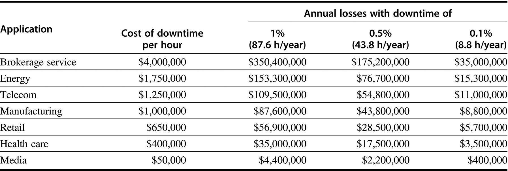

# 服务器

随着1980年代向桌面计算的转变，服务器的作用越来越大，以提供更大规模和更可靠的文件和计算服务。这样的服务器已经成为大规模企业计算的骨干，取代了传统的大型机。

对于服务器来说，不同的特性是很重要的。首先，可靠性是关键。(我们在第1.7节讨论可用性。)考虑一下运行银行ATM机或航空公司预订系统的服务器。这种服务器系统的故障远比单个台式机的故障更具灾难性，因为这些服务器必须每周7天，每天24小时运行。图1.3估计了服务器应用的停机时间的成本。

服务器系统的第二个关键特征是可扩展性。服务器系统经常随着对其支持的服务需求的增加或功能需求的扩大而增长。因此，扩大服务器的计算能力、内存、存储和I/O带宽的能力是至关重要的。

最后，服务器被设计成有效的吞吐量。也就是说，服务器的整体性能--以每分钟的交易量或每秒钟的网页服务量计算--才是关键所在。对单个请求的响应仍然很重要，但整体效率和成本效益，即在单位时间内可以处理多少个请求，是大多数服务器的关键指标。我们将在第1.8节回到评估不同类型的计算环境的性能问题。
