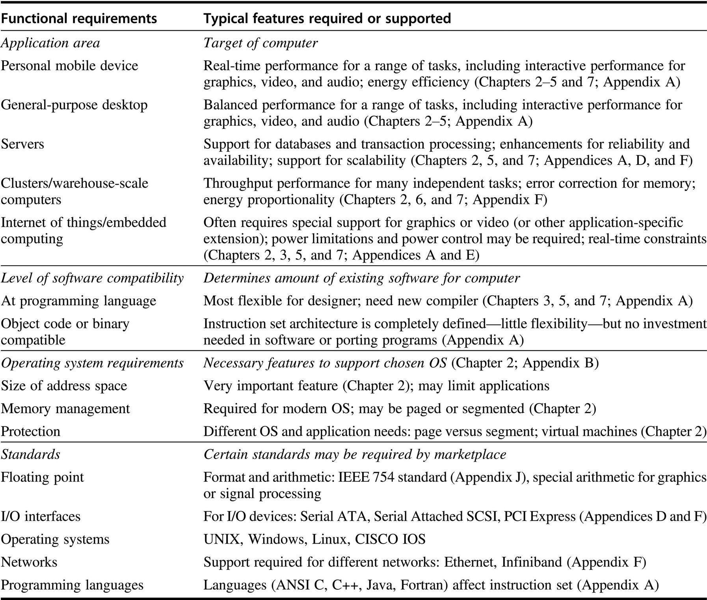

# 名副其实的计算机体系结构：设计组织（Organization）和硬件以满足设计指标和功能需求

计算机的实现有两个组成部分：组织和硬件。组织（organization）一词包括计算机设计的高层次方面，如内存系统、内存之间的互联方式，以及内部处理器或CPU（中央处理单元--实现算术、逻辑、分支和数据传输的地方）的设计。微架构（microarchitecture）这一术语也被用来代替组织结构。例如，两个具有相同指令集架构但不同组织的处理器是AMD Opteron和Intel Core i7。两种处理器都实现了80 x 86指令集，但它们的流水线和高速缓存组织非常不同。

每个微处理器包含多个处理器后，导致核心（core）一词也被用于处理器。与其说多处理器微处理器（multiprocessor microprocessor）这样拗口的词，不如使用多核（multicore），这使得这个词流行起来。鉴于几乎所有的芯片都有多个处理器，中央处理器（CPU）这一术语正在逐渐消失。

硬件是指计算机的具体细节，包括计算机的详细逻辑设计和包装技术。通常一个计算机系列包含具有相同指令集架构和非常相似组织的计算机，但它们在详细的硬件实现方面有所不同。例如，Intel Core i7（见[第三章](../../di-san-zhang-zhi-ling-ji-bing-hang-ji-qi-ying-yong.md)）和Intel Xeon E7（见[第五章](../../di-wu-zhang-xian-cheng-ji-bing-hang.md)）几乎相同，但提供了不同的时钟速率和不同的内存系统，使得Intel Xeon E7对服务器计算机更有效。

在本书中，架构（architecture）一词涵盖了计算机设计的所有三个方面--指令集架构（ISA）、组织或微架构，以及硬件。

计算机架构的设计者必须设计一台计算机来满足功能要求以及价格、功耗、性能和可用性目标。图1.8总结了在设计一台新计算机时需要考虑的要求。通常，架构设计者还必须确定什么是功能需求，这可能是一项重要的任务。这些要求可能是由市场激发的具体功能。应用软件通常通过确定计算机的使用方式来推动对某些功能需求的选择。如果一个特定的指令集结构存在大量的软件，设计者可能会决定新的计算机应该实现一个现有的（译者注：广泛部署的）指令集。如果某一类应用存在一个巨大的市场，可能会鼓励设计者加入一些要求，使计算机在该市场上具有竞争力。后面的章节将深入研究这些要求和功能。

设计者还必须了解技术和计算机使用方面的重要趋势，因为这种趋势不仅影响到未来的成本，而且还影响到设计的架构的寿命。
