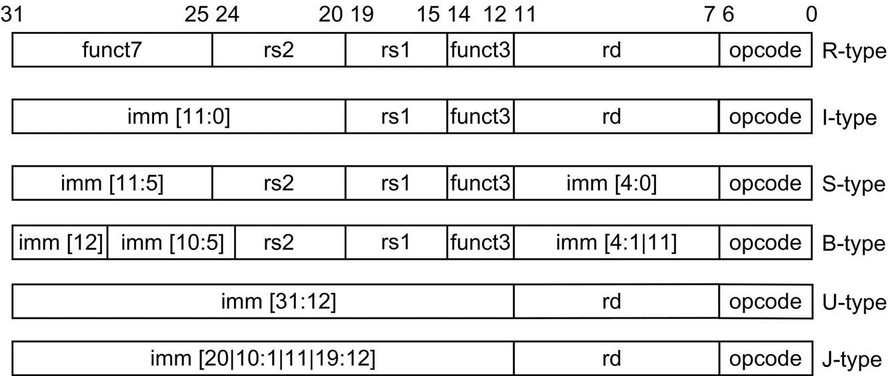

# 指令集架构：计算机体系结构的“狭隘”观点

在本书中，我们用指令集架构（ISA）这个术语来指代实际的程序员可见的指令集。ISA是软件和硬件之间的界限。本书对ISA的快速回顾将使用80x86、ARMv8和RISC-V的例子来说明ISA的七个方面。最流行的RISC处理器来自ARM（Advanced RISC Machine），在2015年出货的148亿颗芯片中，大约是80x86处理器出货量的50倍。附录A和K给出了关于这三种ISA的更多细节。

RISC-V（"RISC-5"）是加州大学伯克利分校开发的现代RISC指令集，应工业界的要求，它被免费公开采用。除了完整的软件栈（编译器、操作系统和模拟器），还有几个RISC-V的实现版本可供免费使用，用于定制芯片或现场可编程门阵列中。在第一个RISC指令集开发30年后，RISC-V继承了其前任的好的设计思想--一组大的寄存器、易于流水线排布的指令和一套精简的操作，同时避免了他们的遗漏或错误。它是前面提到的RISC架构的一个自由、开放、优雅的例子，这就是为什么有60多家公司加入了RISC-V基金会，包括AMD、谷歌、惠普、IBM、微软、Nvidia、高通、三星和西部数据。我们在本书中使用RISC-V的整数核心ISA作为示例ISA。

1. **ISA的类别**-今天几乎所有的ISA都被归类为通用寄存器架构，其中操作数是寄存器或内存位置。80x86有16个通用寄存器和16个可以保存浮点数据的寄存器，而RISC-V有32个通用寄存器和32个浮点寄存器（见图1.4）。这一类的两个流行版本是寄存器-内存式（register-memory）ISA，如80x86，它的一部分指令可以直接访问内存（译者注：比如加法指令，这类ISA可以将内存地址作为操作数放在指令中进行加载，而不需要经过寄存器）；以及加载-存储式（ load-store）ISA，如ARMv8和RISC-V，它只能通过加载或存储指令访问内存。自1985年以来公布的所有ISA都是加载-存储类型的。
2. **内存访问**-几乎所有的桌面和服务器计算机，包括80x86、ARMv8和RISC-V，都使用字节寻址来访问内存操作数。一些架构，如ARMv8，要求对象必须是对齐的。即A mod s = 0：对字节地址A处大小为s字节的对象的访问是对齐的。（见A-8页的图A.5）80x86和RISC-V不要求对齐，但如果操作数是对齐的，访问通常会更快。
3. **寻址方式**--除了指定寄存器和常数操作数外，寻址模式还指定内存对象的地址。RISC-V的寻址模式是a）寄存器、b）立即数和c）位移。对于c），立即数将作为偏移量被添加到寄存器中以形成内存地址。80x86支持上述这三种模式，还额外加上另外三种不同的形式的位移寻址：立即数偏移量寻址；依赖两个寄存器的基于索引的位移寻址；以及同样依赖两个寄存器，其中一个寄存器乘以操作数的字节大小来实现基于缩放索引和位移的寻址。此外，80x86还有更多类似于后三种模式的东西，减去位移字段，加上寄存器间接、索引和基于按比例索引。ARMv8除了有三种RISC-V寻址模式外，还附带加上PC（程序计数器寄存器）相对寻址、两个寄存器之和以及它的变体：其中一个寄存器乘以操作数的存放值。它还具有自动递增和自动递减寻址，其中计算出的地址取代了用于形成地址的一个寄存器的内容。
4. **操作数的类型和大小**-与大多数ISA一样，80x86、ARMv8和RISC-V支持8位（ASCII字符）、16位（Unicode字符或半字）、32位（整数或字）、64位（双字或长整数）的操作数，以及32位（单精度）和64位（双精度）的IEEE 754浮点。80x86还支持80位浮点（扩展双精度）。
5. **操作（Operations）**-操作的一般类别是数据传输、算术逻辑、控制（接下来讨论）和浮点。RISC-V是一个简单的、易于排布的指令集架构，它是2017年正在使用的RISC架构的代表。图1.5总结了整数RISC-V ISA，图1.6列出了浮点ISA。80x86有更丰富、更大的操作集（见[附录K](../../fu-lukzhi-ling-ji-jia-gou-de-hui-gu.md)）。
6. **控制流指令**-几乎所有的ISA，包括这三种（RISC-V，80X86，ARMv8），都支持有条件的分支、无条件的跳转、过程调用和返回。所有这三种指令都使用PC相对寻址，其中分支地址是由添加到PC上的地址域指定的。有一些小的区别。RISC-V条件性分支（BE、BNE等）测试寄存器的内容，而80x86和ARMv8分支测试作为算术/逻辑操操作的附带来设置的条件代码位。ARMv8和RISC-V程序调用将返回地址放在寄存器中，而80x86调用（CALLF）将返回地址放在内存的堆栈中。
7. **ISA的编码方式**-在编码方面有两种基本选择：固定长度和可变长度。所有ARMv8和RISC-V指令的长度为32位，这简化了指令解码。图1.7显示了RISC-V指令的格式。80x86的编码是可变长度的，范围从1到18字节。可变长度的指令可以比固定长度的指令占用更少的空间，所以为80x86编译的程序通常比为RISC-V编译的相同程序要小。请注意，前面提到的选择将影响指令如何被编码成二进制表示。例如，寄存器的数量和寻址模式的数量都对指令的大小有很大影响，因为寄存器字段和寻址模式字段可以在一条指令中出现很多次。(请注意，ARMv8和RISC-V后来提供了扩展，称为Thumb-2和RV64IC，它们分别提供了16位和32位长度的混合指令，以减少程序大小。这些紧凑版本的RISC架构的代码大小比80x86的小。见[附录K](../../fu-lukzhi-ling-ji-jia-gou-de-hui-gu.md))。

在ISA设计之外，计算机架构的设计者所面临的其他挑战在目前尤其突出，因为指令集之间的差异很小，而且有不同的应用领域。因此，从本书的第四版开始，除了这个快速回顾之外，大部分的指令集材料都可以在附录中找到（见[附录A](../../fu-luazhi-ling-ji-she-ji-yuan-ze.md)和[K](../../fu-lukzhi-ling-ji-jia-gou-de-hui-gu.md)）。

