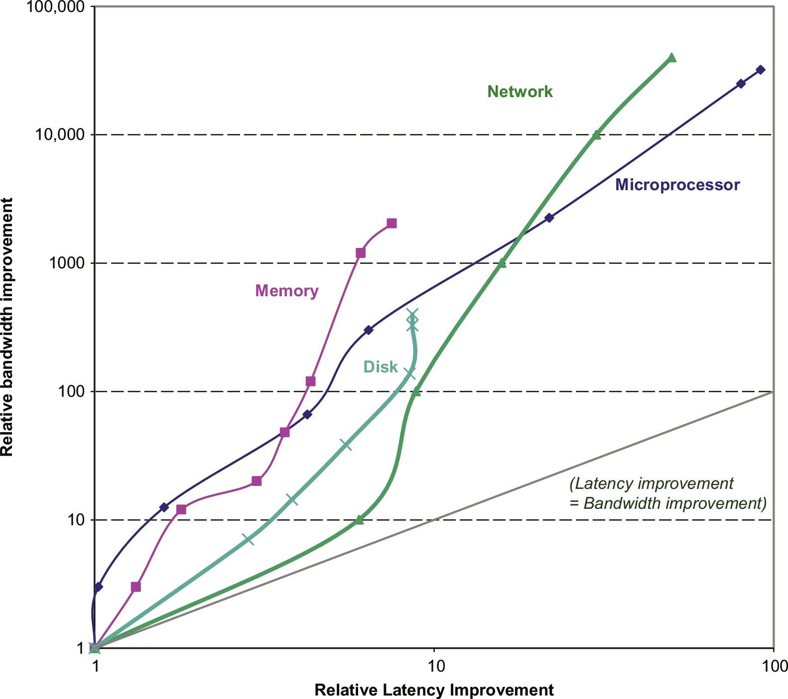

# 性能趋势：带宽的提升大于延迟

正如我们将在第1.8节中看到的，带宽或吞吐量是在一定时间内完成的工作总量，如磁盘传输的MB/s。相比之下，延迟或响应时间是事件开始和完成之间的时间，比如磁盘访问的毫秒。图1.9显示了微处理器、内存、网络和磁盘的技术里程碑在带宽和延迟方面的相对改进。图1.10更详细地描述了这些例子和里程碑。

性能是微处理器和网络的主要区别因素，因此它们的收益最大。带宽提高了32,000-40,000倍，延迟提高了50-90倍。对于内存和磁盘来说，容量通常比性能更重要，所以容量的提高更多，但400-2400倍的带宽进步仍然比8-9倍的延迟进步大得多。

显然，在这些技术中，带宽已经超过了延迟，而且可能会继续这样做。一个简单的经验法则是，带宽的增长至少是延时改进的平方。计算机设计者应该据此制定计划。
