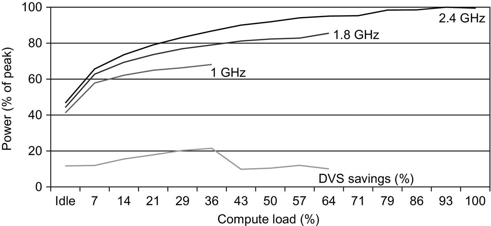

# 微处理器内的能耗和功率

对于CMOS芯片来说，传统的主要能源消耗是在开关晶体管上，也称为动态能源。每个晶体管所需的能量与晶体管所驱动的电容负载（capacitive load）和电压（voltage）的平方的乘积成正比：

这个方程式是0→1→0或1→0→1的逻辑转换的脉冲能量。那么单次转换（0→1或1→0）的能量为：

每个晶体管所需的功率只是一个转换的能量乘以转换的频率的乘积:

对于一个固定的任务，放慢时钟频率可以降低功率，但不能降低能量。

显然，动态功率和能量通过降低电压而大大减少，所以电压在20年内从5V降到了1V以下。电容负载是连接到一个输出的晶体管数量和技术的函数，它决定了导线和晶体管的电容。

**示例：**当今的一些微处理器被设计成电压可调，因此电压降低15%可能会导致频率降低15%。对动态能量和动态功率的影响会怎样呢？

**答案：**因为电容没有变化，所以能量的答案是电压的比率：

&#x20;          这使得能量减少到原来的72%左右。对于功率，我们加上频率的比率：

&#x20;          可以看到，减少到了原来的61%。

随着我们从一个工艺到下一个工艺，晶体管开关数量的增加和它们频率的提高主导了负载电容和电压的减少，（译者注：但是增大的幅度过大，）导致了功耗和能量的全面增长。第一批微处理器的功耗不到一瓦，第一批32位微处理器（如英特尔80386）的功耗约为2瓦，而4.0GHz的Intel Core i7-6700K的功耗为95瓦。鉴于这些热量必须从边长约1.5厘米的芯片中散出，我们已接近空气冷却的极限，而这正是我们近十年来一直停留的地方。

考虑到前面的等式，如果我们不能降低电压，不然增加每个芯片的功率，你只能希望时钟频率的增长放缓。图 1.11 显示，自 2003 年以来，情况确实如此，即使是图 1.1 中每年表现最好的微处理器也是如此。请注意，这段较平坦的时钟速率时期与图1.1中性能改善范围缓慢的时期相对应。

分散功率、消除热量和防止热点已成为越来越困难的挑战。能耗现在是使用晶体管的主要制约因素；在过去，它是原始硅面积。然而现在只能在保持时钟速率持平，电源电压恒定的情况下提高能效。为此，现代微处理器发展了很多技术：

1. **什么都不做的好。**今天，大多数微处理器关闭不活动模块的时钟，以节省能源和动态功率。例如，如果没有浮点指令在执行，浮点单元的时钟就被禁用。如果一些内核处于空闲状态，它们的时钟就会停止。
2. **动态电压-频率缩放（DVFS）。**第二项技术直接来自前面的公式。PMD、笔记本电脑、甚至服务器都有低活动期，不需要在最高的时钟频率和电压下运行。现代微处理器通常提供一些时钟频率和电压，在这些频率和电压下工作，使用的功率和能量较低。图1.12显示了服务器在三种不同的时钟频率下，随着工作负荷的减少，通过DVFS可能节省的功率。2.4、1.8和1GHz。在两个步骤中的每一个步骤中，服务器的总体功率节省约为10%-15%。
3. **对症下药。**鉴于PMD和笔记本电脑经常处于闲置状态，内存和存储提供低功率模式以节省能源。例如，DRAM有一系列越来越低的功率模式，以延长PMD和笔记本电脑的电池寿命，还有人提议磁盘有一种模式，在未使用时旋转得更慢，以节省能源。然而，你不能在这些模式下访问DRAM或磁盘，所以你必须返回到完全激活的模式来进行读写，无论访问率有多低。如前所述，个人电脑的微处理器是为在高工作温度下大量使用而设计的，依靠片上温度传感器来检测何时应自动减少活动以避免过热。这种 "紧急减速 "使制造商能够为更典型的情况进行设计，然后在有人真的运行比通常情况下消耗更多电力的程序时依靠这种安全机制。
4. **超频。**英特尔在2008年开始提供Turbo模式，芯片决定在短时间内以更高的时钟速率运行是安全的，可能只是在几个核心上，直到温度开始上升。例如，3.3 GHz的Core i7可以在短时间内运行3.6 GHz。事实上，自2008年以来，图1.1所示的每年性能最高的微处理器都提供临时超频，比标称的时钟速率高出约10%。对于单线程代码，这些微处理器可以关闭除一个内核外的所有内核，运行速度更快。请注意，尽管操作系统可以关闭Turbo模式，但一旦启用就不会有任何通知，所以程序员可能会惊讶地看到他们的程序因室温而出现性能差异。

尽管传统上认为动态功率是CMOS中功率耗散的主要来源，但静态功率正成为一个重要的问题，因为即使在晶体管关闭时也有漏电电流流动：

也就是说，静态功率与器件的数量成正比。

因此，增加晶体管的数量会增加功率，即使它们是空闲的，而且在晶体管尺寸较小的处理器中，电流泄漏也会增加。因此，非常低功耗的系统甚至关闭不活动模块的电源（电源门控），以控制因漏电造成的损失。2011年，漏电的目标是总功耗的25%，高性能设计中的漏电有时远远超过这一目标。这类芯片的漏电率可能高达50%，部分原因是大型SRAM缓存需要电源来维持存储值。(SRAM中的S代表静态。)停止泄漏的唯一希望是关闭芯片子集的电源。

最后，由于处理器只是系统整个能源成本的一部分，使用一个更快的、能源效率较低的处理器来让系统的其他部分进入睡眠模式是有意义的。这种策略被称为 "竞速"。

功率和能耗的重要性增加了对创新效率的审查，因此现在的主要评估是每焦耳的任务或每瓦特的性能，而不是像过去那样每平方毫米的硅的性能。正如我们在[第四章](../../di-si-zhang-shi-liang-simd-he-gpu-jia-gou-zhong-de-shu-ju-ji-bing-hang-xing.md)和[第五章](../../di-wu-zhang-xian-cheng-ji-bing-hang.md)中所看到的，这种新的衡量标准影响了并行化的方法。

