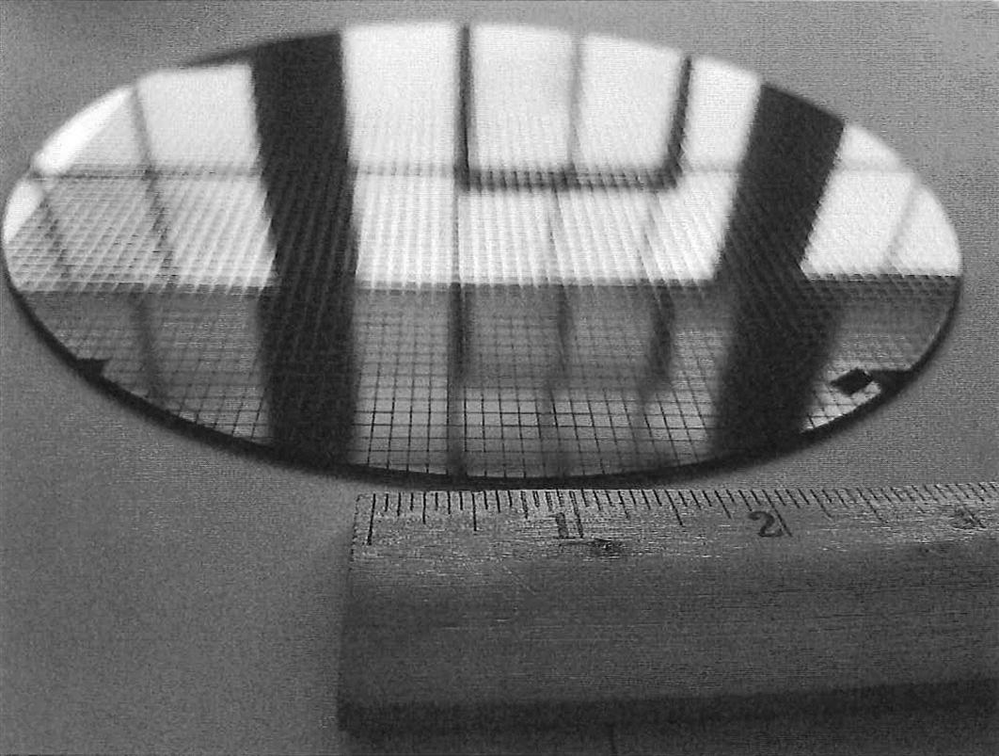
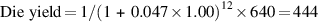

# 集成电路的成本

为什么一本计算机结构的书会有一个关于集成电路成本的章节？在竞争日益激烈的计算机市场上，标准件--磁盘、闪存、DRAM等等--正在成为任何系统成本的重要组成部分，集成电路成本正在成为不同计算机成本的更大一部分，特别是在高容量、对成本敏感的市场部分。事实上，随着PMD越来越依赖整个芯片上的系统（SOC），集成电路的成本占PMD成本的大部分。因此，计算机设计师必须了解芯片的成本，以了解目前计算机的成本。

尽管集成电路的成本已经成倍下降，但硅制造的基本过程没有改变。晶圆（wafer）仍然要经过测试，然后切成晶片（dies），再进行封装（见图1.14-1.16）。因此，一个封装的集成电路的成本是：

在这一节中，我们主要讨论芯片的成本，最后总结一下测试和封装的关键问题。

学习如何预测每个晶圆上的好芯片的数量，首先需要学习晶圆上适合多少芯片，然后学习如何预测这些芯片中能工作的百分比。预测成本为：

芯片成本方程式的这个初始项最有趣的特点是它对芯片尺寸的敏感性，如下图所示。

每块晶圆的芯片数量大约是晶圆的面积除以芯片的面积。它可以通过以下方式更准确地估计：

第一个项是晶圆面积（πr2）与芯片面积的比率。第二项是对 "方枘圆凿 "问题的补偿--圆形晶圆外围附近的矩形芯片。用圆周率（πd）除以正方形晶粒的对角线，大约就是沿边缘的晶粒数量。

**示例：**找出每块300毫米（30厘米）晶圆中边长为1.5厘米的晶片和边长为1.0厘米的晶片的数量。

**答案：**当晶片面积为2.25厘米时：

因为大晶片的面积是小晶片的2.25倍，所以每块晶圆上大晶片的数量比小晶片的数量小2.25倍：

然而，这个公式只给出了每个晶圆上的最大晶片数。关键的问题是：一个晶圆上好的晶片的比例是多少，或者说是晶片产量？一个简单的集成电路良品率模型，假设缺陷是随机分布在晶圆上的，并且良品率与制造工艺的复杂性成反比，可以得出以下结果：

这个Bose-Einstein公式是通过观察许多生产线的产量而建立的经验模型（Sydow，2006），它今天仍然适用。晶圆成品率（wafer yield）用于说明完全坏的晶圆不需要进入测试环节。为简单起见，我们只假设晶圆成品率为100%，即没有完全坏掉的晶圆。每单位面积的缺陷是对发生的随机制造缺陷的一种衡量。在2017年，该值对于28纳米节点来说通常是每平方英寸0.08-0.10个缺陷，对于较新的16纳米节点来说是0.10-0.30个，因为它取决于工艺的成熟度（回顾前面提到的学习曲线）。公制版本是28纳米的每平方厘米0.012-0.016个缺陷，16纳米的0.016-0.047。最后，N是一个被称为工艺复杂度系数的参数，是对制造难度的衡量。对于2017年的28纳米工艺，N是7.5-9.5。对于16纳米工艺，N在10至14之间。

示例：假设缺陷密度为0.047/cm2，N为12，求边长为1.5cm和1.0cm的晶片产量。

答案：晶片面积分别为2.25和1.00平方厘米。对于较大的晶片，产量为：

较小的晶片，产量为：

尽管许多微处理器在1.00至2.25平方厘米之间，但低端的嵌入式32位处理器有时小到0.05平方厘米，用于嵌入式控制的处理器（用于廉价的物联网设备）通常小于0.01平方厘米，而高端服务器和GPU芯片可以大到8平方厘米。

鉴于DRAM和SRAM等商品的巨大价格压力，设计者将冗余作为提高产量的一种方式。若干年来，DRAM经常包括一些冗余的存储单元，以便可以容纳一定数量的缺陷。设计师在标准SRAM和用于微处理器内缓存的大型SRAM阵列中都使用了类似的技术。出于同样的原因，GPU在84个处理器中设有4个冗余处理器。很明显，冗余项的存在可以用来大幅提升产量。

2017年，用28纳米技术加工一个直径300毫米（12英寸）的晶圆，成本在4000至5000美元之间，16纳米晶圆的成本约为7000美元。假设加工的晶圆成本为7000美元，1.00平方厘米的芯片的成本约为16美元，但2.25平方厘米的芯片的每个芯片成本约为58美元，或几乎是小两倍多一点面积的芯片成本的四倍。

关于芯片成本，计算机设计师应该记住什么？制造工艺决定了晶圆成本、晶圆产量和单位面积的缺陷，所以设计者唯一能控制的是芯片面积。在实践中，由于每单位面积的缺陷数量较少，每个晶圆上的好芯片的数量，以及因此每个芯片的成本，大致上随着芯片面积的平方而增长。计算机设计者通过在芯片上包含或排除哪些功能以及I/O引脚的数量来影响芯片的尺寸，从而影响成本。

在我们拥有一个可以在计算机中使用的部件之前，芯片必须经过测试（以区分好的芯片和坏的芯片）、包装，并在包装后再次测试。这些步骤都会增加大量的成本，使总成本增加一半。

前面的分析集中在生产功能性芯片的可变成本上，这对大批量的集成电路来说是合适的。然而，在固定成本中，有一个非常重要的部分会大大影响小批量（少于100万个零件）的集成电路的成本，即掩模组的成本。集成电路工艺中的每一步都需要一个单独的掩模。因此，对于具有多达10个金属层的现代高密度制造工艺，16纳米的掩膜成本约为400万美元，28纳米的掩膜成本为150万美元。

好消息是，半导体公司提供 "穿梭运行"（shuttle runs），以大幅降低微小测试芯片的成本。他们通过将许多小设计放在一个晶片上以摊销掩模成本来降低成本，然后再将晶片分成小块用于每个项目。因此，台积电在2017年以30,000美元的价格提供了80-100个未经测试的晶片，这些晶片在28纳米工艺中是1.57 × 1.57毫米。虽然这些晶片很小，但它们为设计师提供了数百万个晶体管供其发挥。例如，几个RISC-V处理器将适合在这样的晶片上。

尽管穿梭运行有助于原型设计和调试运行，但它们不能解决几万到几十万个零件的小批量生产。由于掩模成本可能会继续增加，一些设计者正在加入可重构逻辑，以提高零件的灵活性，从而减少掩模的成本影响。
