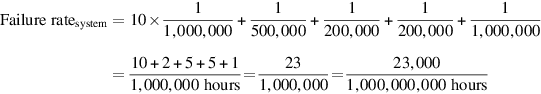
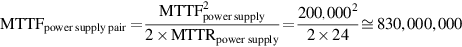

# 1.7 可靠性

历史上，集成电路是计算机中最可靠的部件之一。尽管它们的引脚可能是脆弱的，而且故障可能发生在通信通道上，但芯片内部的故障率是非常低的。随着我们走向16纳米和更小的特征尺寸，这种传统认知正在发生变化，因为瞬时故障和永久故障都变得越来越普遍，所以设计者必须设计系统来应对这些挑战。本节对可靠性方面的问题进行了快速的概述，把术语和方法的正式定义留给附录D中的D.3节。

计算机是在不同的抽象层次上设计和构造的。我们可以通过计算机系统不断地“递归的”往下看，看到组件将自己放大到完整的子系统，直到我们放大到单个晶体管。虽然有些故障是广泛的，如断电，但许多故障可以限制在一个模块中的单一组件。因此，在某一个层次上的模块的全方位的错误可能被认为只是一个更高层次模块的组件错误。这种不同层级的错误分类，对于试图找到建立可靠计算机的方法是很有帮助的。

一个困难的问题是决定一个系统何时能够正常运行。随着互联网服务的普及，这一理论观点变得具体起来。基础设施供应商开始提供服务水平协议（ _S_ervice Level Agreements_，_SLA）或服务水平目标（Service Level Objectives_，_SLO）来保证他们的网络或电力服务是可靠的。例如，如果客户的设备没有达到协议中每月多少小时的无故障运行，他们会向客户支付赔偿金。因此，SLA可以用来确定系统运行或停机的频率。

对于SLA，系统在两种服务状态之间交替进行：

1. 服务完成，即按协议正常提供服务。
2. 服务中断，即交付的服务与SLA不同。

这两种状态之间的转换是由**故障**（failures）（从状态1到状态2）或**恢复**（restorations ）（2到1）引起的。对这些转换进行量化，可以得出两个主要的可依赖性衡量标准：

**模块的可信度（reliability），**这是对从一个参考的初始瞬间开始的连续服务成就（或者说，等同于故障时间）的衡量。因此，平均故障时间（Mean Time To Failure_，_MTTF）是一种可靠性测量。MTTF的倒数是故障率，一般报告为每十亿小时的故障率，或FIT（failures in time）。因此，1,000,000小时的MTTF等于$$10^9$$除以$$10^6$$，即1000 FIT。服务中断是以平均修复时间（mean time to repair_，_MTTR）来衡量。平均故障间隔时间（Mean time between failures_，_MTBF）是简单的MTTF+MTTR之和。虽然MTBF被广泛使用，但MTTF往往是更合适的术语。如果一个模块的集合具有指数分布的寿命--这意味着一个模块的寿命在故障概率中并不重要，那么这个集合的总故障率就是各模块的故障率之和。

**模块可用度（availability ）**，这是对完成和中断两种状态交替的服务成就的衡量。对于有维修的非冗余系统，模块可用性为：

请注意，可信度和可用度现在是可量化的指标，而不是可靠度的同义词。从这些定义中，如果我们对部件的可靠性做一些假设，并认为故障是独立的，我们就可以定量地估计系统的可靠性。

**示例**：假设一个磁盘子系统有以下组件和MTTF：

* 10块磁盘，每块的MTTF值为1,000,000小时
* 1个ATA控制器，500,000小时的MTTF
* 1个电源，200,000小时MTTF
* 1条ATA电缆，1,000,000小时MTTF

使用简化的假设，即寿命是指数分布的，故障是独立的，计算整个系统的MTTF。

**答案**：故障率之和为：

即23000FIT。系统的MTTF是FIT的倒数：

即少于五年。

应对故障的主要方法是冗余，要么是时间上的冗余（重复操作，看是否仍有错误），要么是资源上的冗余（有其他组件来接替发生故障的组件）。一旦组件被替换，系统被完全修复，系统的可靠性就会被假定为和新的一样好。让我们用一个例子来量化冗余的好处。

**示例**：磁盘子系统通常有冗余的电源来提高可靠性。假设一个电源足以运行磁盘子系统，并且我们要增加一个冗余电源。使用前面的组件和MTTFs，计算冗余电源的MTTF。

**答案**：我们需要一个公式来表明，当我们可以容忍一个故障而仍能提供服务时，应该怎样做。为了简化计算，我们假设组件的寿命是指数分布的，并且组件故障之间没有依赖关系。我们的冗余电源的MTTF是直到一个电源发生故障的平均时间除以另一个电源在第一个电源被替换之前发生故障的机会。因此，如果在维修前发生第二次故障的机会很小，那么这对电源的MTTF就很大。

由于我们有两个电源和独立的故障，直到一个电源故障的平均时间是$${MTTF}_{power supply}/2$$。第二个故障的概率的一个很好的近似值是MTTR超过另一个电源故障前的平均时间。因此，一对冗余电源的一个合理近似值是:

结合上一个示例的电源MTTF值，并且我们假设人类操作者平均需要24小时才能注意到一个电源发生故障并进行更换。将这两个数值带入上式，那么这对容错电源的可靠性为：

这个可信度是单电源的4150倍。

在量化了计算机技术的成本、功率和可靠性之后，我们准备对性能进行量化。
