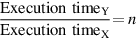
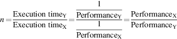

# 1.8 评测、报告和总结性能

当我们说一台电脑比另一台电脑快时，我们是什么意思？手机用户可能会说，当程序运行的时间更短时，电脑就更快，而亚马逊网站的管理员可能会说，当电脑每小时完成更多的交易时，电脑就更快。手机用户希望减少响应时间，即事件开始和完成之间的时间，也被称为执行时间。WSC的操作员希望增加吞吐量--在一定时间内完成的工作总量。

在比较设计方案时，我们经常想把两台不同的计算机的性能联系起来，比如说X和Y。"X比Y快 "这句话在这里的意思是，对于给定的任务，X上的响应时间或执行时间比Y上低。特别是，"X比Y快n倍 "将意味着：

由于执行时间是性能的倒数，以下关系成立：

"X的吞吐量是Y的1.3倍 "这句话在这里表示，在计算机X上每单位时间完成的任务数是Y上完成的1.3倍。

不幸的是，在比较计算机的性能时，时间并不总是被引用的指标。我们的立场是，衡量性能的唯一一致和可靠的标准是真实程序的执行时间，所有提议的替代时间作为衡量标准，或替代真实程序作为衡量项目的方法，最终都导致了误导性的决策，是计算机设计中的错误。

即使是执行时间也可以用不同的方式来定义，这取决于我们计算的内容。最直接的时间定义被称为壁钟时间（wall-clock time）、响应时间（response time）或耗时（elapsed time），它是完成一项任务的延迟，包括存储访问、内存访问、输入/输出活动、操作系统开销等等。在多程序（multiprogramming）执行中，处理器在等待I/O的同时还在另一个程序上工作，不一定能将一个程序的耗时降到最低。因此，我们需要一个术语来考虑这种活动。**CPU时间**体现了这一区别，它表示处理器正在计算的时间，不包括等待I/O或运行其他程序的时间。(显然，用户看到的响应时间是程序的耗费时间，而不是CPU时间）。

经常运行相同程序的计算机用户将是评估一台新计算机的最佳人选。为了评估一个新的系统，这些用户将简单地比较他们的工作负载（workloads）的执行时间--用户在计算机上运行的程序和操作系统命令的集合。然而，很少有人处于这种幸福的境地。大多数人必须依靠其他方法来评估计算机，而且往往是这些人，希望这些方法能够预测他们使用新计算机的性能。一种方法是基准程序（benchmark programs），这是许多公司用来建立其计算机的相对性能的程序。
