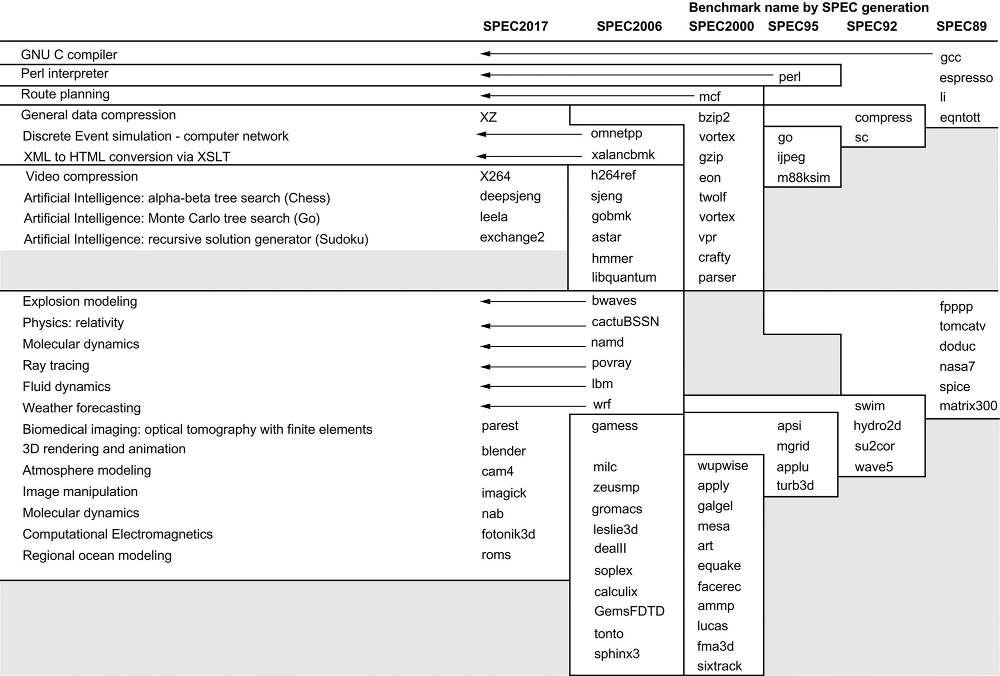

# 桌面应用基准

桌面基准分为两大类：处理器密集型基准和图形密集型基准，尽管许多图形基准包括密集的处理器活动。SPEC最初创建了一个专注于处理器性能的基准集（最初称为SPEC89），它已经发展到第六代。SPEC CPU2017，继SPEC2006、SPEC2000、SPEC95 SPEC92和SPEC89之后。SPEC CPU2017由一组10个整数基准（CINT2017）和17个浮点基准（CFP2017）组成。图1.17描述了当前的SPEC CPU基准和它们的前辈。

