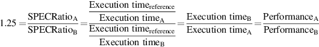
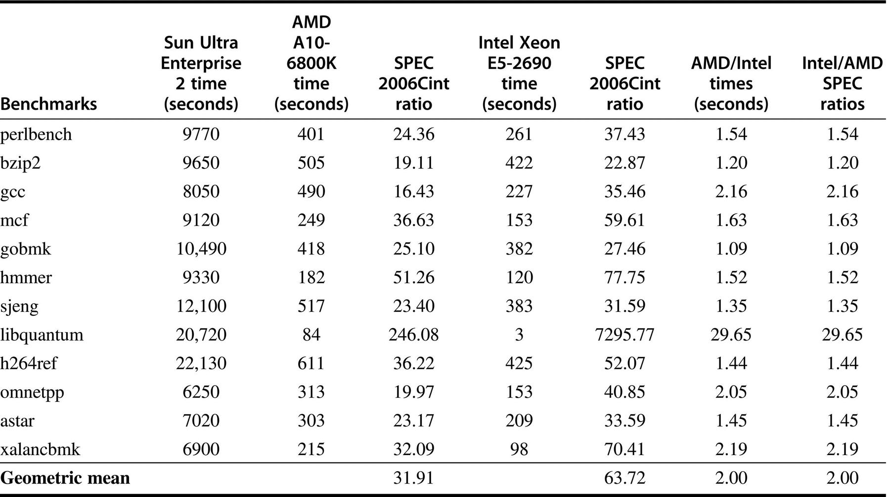
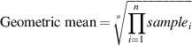
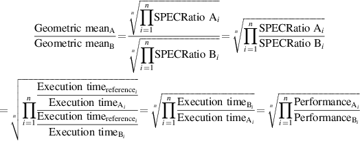

# 总结性能结果

在实际的计算机设计中，人们必须评估无数的设计选择，以确定它们在一系列被认为是相关的基准中的相对的量化测试结果的收益。同样地，试图选择计算机的消费者将依赖于来自基准的性能评测，这些基准最好与用户的应用相似。在这两种情况下，拥有一套基准的测量结果是很有用的，这样重要的应用程序的性能就会与这套基准中的一个或多个基准相似，这样就可以理解性能的变化。在最好的情况下，该套件类似于应用空间的一个统计学上的有效样本，但这样的样本需要比大多数套件中通常发现的更多的基准，并且需要随机抽样，而基本上没有基准套件使用这种方法。

一旦我们选择用一个基准套件来测量性能，我们希望能够用一个独特的数字来总结该套件的性能结果。计算总结结果的一个简单方法是比较套件中程序的执行时间的算术平均值。另一种方法是给每个基准添加一个加权因子，并使用加权算术平均值作为总结性能的单一数字。一种方法是使用权重，使所有程序在某些参考计算机上的执行时间相等，但这使结果偏向于参考计算机的性能特征。

与其选择权重，我们可以通过将参考计算机上的时间除以被评测计算机上的时间来使执行时间规范化（normalization），从而产生一个与性能成正比的比率。SPEC采用了这种方法，将该比率称为SPECRatio。它有一个特别有用的属性，与我们在本文中对计算机性能进行基准测试的方式相匹配，即比较性能比率。例如，假设计算机A在一项基准测试中的SPECRatio是计算机B的1.25倍；那么我们知道：

请注意，参考计算机上的执行时间下降了，当以比率进行比较时，参考计算机的选择是不相关的，这也是我们一贯使用的方法。图1.19给出了一个例子：

因为SPECRatio是一个比率，而不是一个绝对的执行时间，所以必须使用几何平均数来计算平均值。(因为SPECRatios没有单位，用算术方法比较SPECRatios是没有意义的）。该公式为：

在SPEC的情况下，$$sample_i$$是程序i的SPECRatio。使用几何平均数可以确保两个重要的特性：

1. 比率的几何平均值与几何平均值的比率相同。
2. 几何平均数的比率等于性能比率的几何平均数，这意味着参考计算机的选择是不相关的。 因此，使用几何平均数的动机是很大的，特别是当我们使用性能比来进行比较时。

**示例**：证明几何平均值的比率等于性能比率的几何平均值，并说明SPECRatio的参考计算机并不重要。

**答案**：假设有两台计算机A和B，每台都有一组SPECRatios：

也就是说，A和B的SPECRatios的几何平均值的比率是套件中所有基准的A对B的性能比率的几何平均值。图1.19用SPEC的例子证明了这种有效性。

