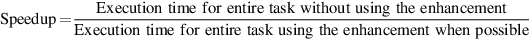

# 阿姆达尔定律

通过改进计算机的某些部分可以获得的性能增益可以用阿姆达尔定律来计算。阿姆达尔定律指出，通过使用某种更快的执行模式所获得的性能改进，受到可以使用这个更快模式的时间长度的限制。

阿姆达尔定律定义了通过使用一个特定的功能可以获得的速度提升。什么是速度提升？假设我们可以对计算机做一个改进，当它被使用时，会提高性能。加速具体指一种比率：

或者：

加速比告诉我们，与原来的计算机相比，使用带有增强功能的计算机，一项任务的运行速度将提高多少。

阿姆达尔定律给了我们一个快速的方法来找到一些增强的速度，这取决于两个因素：

1. 原有计算机的计算时间中可以转换为利用增强的部分--例如，如果一个总共需要100秒的程序的执行时间中有40秒可以利用增强，那么这个分数就是40/100。这个值，我们称之为$$Fraction_{enhanced}$$，总是小于或等于1。
2. 增强的执行模式获得的改进，也就是说，如果在整个程序中使用增强的模式，任务的运行速度会快多少--这个值是原始模式的时间超过增强模式的时间。如果增强模式在部分程序中需要4秒，而在原始模式中需要40秒，那么改进就是40/4或10。我们把这个总是大于1的值称为 $$speed_{enhanced}$$。

使用具有增强模式的原始计算机的执行时间将是使用计算机未增强部分的时间加上使用增强部分的时间：

总体速度的提高是执行时间的比率：​

**示例**：假设我们想加强用于网络服务的处理器。新的处理器在网络服务应用中的计算速度是旧处理器的10倍。假设原来的处理器40%的时间在忙于计算，60%的时间在等待I/O，那么加入改进后获得的整体速度是多少？

**答案**：

阿姆达尔定律蕴含了收益递减的规律。只对一部分计算进行改进所获得的提升会随着改进的增加而减少。阿姆达尔定律的一个重要推论是，如果某个改进只适用于任务的一部分，那么我们对该任务的加速不能超过某个值，这个值是1减去这个部分百分比的倒数。

在应用阿姆达尔定律时，一个常见的错误是混淆了 "转换为使用增强功能的时间百分比 "和 "增强功能使用后的时间的百分比"。如果我们不测量在计算中可以使用增强功能的时间，而是测量增强功能使用后的时间，那么结果将是不正确的!

阿姆达尔定律可以作为一个指南，指导一个增强功能会在多大程度上提高性能，以及如何分配资源以提高成本效益。显然，我们的目标是将资源的使用与时间的使用成正比。阿姆达尔定律对于比较两个备选方案的整体系统性能特别有用，但它也可以应用于比较两个处理器设计方案，正如下面的例子所示。

**示例**：图形处理器中需要的一个常见转换是平方根。浮点（FP）平方根的实现在性能上差异很大，特别是在为图形设计的处理器中。假设FP平方根（FSQRT）在一个关键图形基准的执行时间中占了20%。一种建议是增强FSQRT硬件，将该操作的速度提高10倍。另一个方案只是试图使图形处理器中的所有FP指令的运行速度提高1.6倍；FP指令负责该应用的一半执行时间。设计团队认为，他们可以用与快速平方根相同的努力使所有FP指令运行快1.6倍。比较这两种设计方案。

**答案**：我们可以通过比较加速比来对这两种选择进行比较：

由于FP指令出现的频率高，提高FP指令的性能总体上稍好。

阿姆达尔定律在性能之外也是适用的。让我们重做[1.7节](../1.7-ke-kao-xing.md)可靠性例子，在通过冗余提高电源的可靠性后，从200,000小时提高到830,000,000小时的MTTF，或4150倍的改善。

**示例**：磁盘子系统的故障率的计算是：

可以改进的故障率基本上是每百万小时5，总时间为23，那么比率为0.22。

答案：可靠性的提高将是：

尽管一个模块的可靠性有了令人印象深刻的4150×的提高，但从系统的角度来看，这种变化的好处是可衡量的，但很小。

在前面的例子中，我们需要新版本和改进版本的某一项所占的百分比；通常情况下，很难直接测量这些时间。在下一节中，我们将看到另一种进行这种比较的方法，它是基于使用一个将CPU执行时间分解为三个独立部分的方程式。如果我们知道一个替代方案如何影响这三个部分，我们就可以确定其整体性能。此外，在实际设计硬件之前，通常有可能建立模拟器来测量这些部分。
