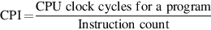
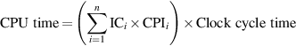

# 处理器性能方程

基本上所有的计算机都是使用一个以恒定速率运行的时钟构造的。这些离散的时间事件被称为时钟周期、时钟、周期或时钟循环。计算机设计者用持续时间（如1ns）或速率（如1GHz）来指代一个时钟周期的时间。那么一个程序的CPU时间可以用两种方式表示：

或者：

除了执行程序所需的时钟周期数之外，我们还需要计算执行的指令数--指令路径长度（instruction path length）或指令数（instruction count，IC）。如果我们知道时钟周期数和指令数，我们就可以计算出每条指令的平均时钟周期数（clock cycles per instruction，CPI）。因为它更容易操作，而且在本章中我们只分析简单的处理器，所以我们使用CPI。设计者有时也使用每时钟指令数（instructions per clock，IPC），它是CPI的倒数。

CPI的计算方式为：

这个处理器指数的优点是：提供了对不同风格的指令集和实现的观察方式，我们将在接下来的四章中广泛使用它。

通过将前述公式中的指令数换位，时钟周期可以定义为IC×CPI。这使得我们可以在执行时间公式中使用CPI：

将第一个公式扩展到测量单位中，可以看出这些部分是如何结合在一起的：

正如这个公式所显示的，处理器的性能取决于三个特性：时钟周期（或速率）、每条指令的时钟周期和指令数。此外，CPU时间也同样取决于这三个特性；例如，其中任何一个特性的10%的改进都会导致CPU时间的10%的改进。

不幸的是，很难完全孤立地改变一个参数，因为改变每个特性所涉及的基本技术是相互依赖的：

* 时钟周期时间-硬件技术和组织
* CPI-组织和指令集架构
* 指令数-指令集架构和编译器技术

幸运的是，许多潜在的性能改进技术主要是增强处理器性能某一个组成部分，而对其他两个组成部分的影响很小或可以预测。

在设计处理器时，有时计算总的处理器时钟周期的数量是很有用的，即：

其中$$IC_i$$指令表示指令i在程序中被执行的次数，CPIi代表指令i每条指令的平均时钟数。 这种形式可以用来表示CPU时间为：

总体的CPI为：

后一种形式的CPI计算使用每个单独的CPIi和该指令在程序中出现的比例（即ICi÷指令数）。因为它必须包括流水线效应、高速缓存缺失和任何其他内存系统的低效率，$$CPI_i$$该被测量，而不是仅仅从参考手册后面的表格中计算出来。

考虑一下我们在[上一节](a-mu-da-er-ding-lv.md)的性能例子，在此修改为使用指令频率和指令CPI值的测量，在实践中，这些测量是通过模拟或硬件仪器获得的。

**示例**：假设我们做了以下测量。

* FP操作的频率=25%
* FP操作的平均CPI=4.0&#x20;
* 其他指令的平均CPI = 1.33&#x20;
* FSQRT的频率=2%&#x20;
* FSQRT的CPI=20

假设两个设计方案是将FSQRT的CPI降低到2或将所有FP操作的平均CPI降低到2.5。使用处理器性能方程比较这两种设计方案。

**答案**：首先，观察一下，只有CPI发生了变化；时钟频率和指令数仍然是相同的。我们首先找到两个都没有增强的原始CPI：

我们可以通过从原始CPI中减去节省的周期来计算增强型FSQRT的CPI：

我们可以用同样的方法计算所有FP指令的增强的CPI，或者通过FP和非FP的CPI相加来计算。使用后者，我们可以得到：

由于整体FP增强的CPI略低，其性能将略微好一些。具体来说，整体FP增强的速度提升为：

令人高兴的是，我们使用[上一节](a-mu-da-er-ding-lv.md)的阿姆达尔定律也得到了这个比率。

通常可以测量处理器性能方程的构成部分。这种单独的测量是使用处理器性能方程与前面例子中的阿姆达尔定律相比的一个关键优势。但有些具体的问题：可能很难测量诸如一组指令所占的执行时间的比例。在实践中，这可能是通过计算指令数和指令集中每个指令的CPI的乘积来实现的。由于起点通常是单个指令数和CPI的测量，处理器性能方程非常有用。

为了使用处理器性能方程作为设计工具，我们需要能够测量各种因素。对于一个现有的处理器，通过测量很容易获得执行时间，而且我们知道默认的时钟速度。挑战在于统计指令数或CPI。大多数处理器包括执行指令和时钟周期的计数器。通过定期监测这些计数器，或者将执行时间和指令数附加到代码段上，这对试图了解和调整应用程序性能的程序员是有帮助的。通常情况下，设计者或程序员希望在比硬件计数器更细的层次上了解性能。例如，他们可能想知道为什么CPI是这样的。在这种情况下，可以利用仿真技术来指导设计处理器。

有助于提供能效的技术，如动态电压频率缩放和超频（见第1.5节），使这个方程更难使用，因为在我们测量程序时，时钟速度可能会变化。一个简单的方法是关闭这些功能，使结果具有可重复性。幸运的是，由于性能和能效通常是高度相关的--花更少的时间来运行一个程序通常会节省能源--所以考虑性能可能是安全的，而不必担心DVFS或超频对结果的影响。
