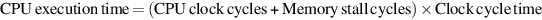
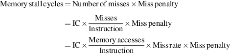
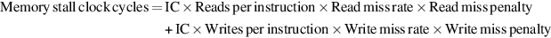
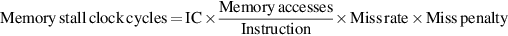

# 缓存性能回顾

由于局部性和较小存储器的速度较高，存储器的层次结构可以大幅度提高性能。评估高速缓存性能的一个方法是扩展第一章中的处理器执行时间方程。我们现在考虑到处理器在等待内存访问时停滞的周期数，我们称之为内存停滞周期（memory stall cycles）。那么，性能就是时钟周期时间与处理器周期和内存停滞周期之和的乘积：

这个等式假设CPU的时钟周期包括处理高速缓存命中的时间，并且处理器在高速缓存缺失期间是停滞的。B.2节重新审视了这个简化的假设。

内存停滞周期的数量取决于失误的数量和每次失误的成本，这被称为未命中惩罚（miss penalty）:

最后一种形式的优点是，可以很容易地测量各个部分。我们已经知道如何测量指令数（IC）。（ 对于推测性处理器，我们只计算提交的指令）测量每条指令的内存引用数量也可以用同样的方式完成；每条指令都需要一个指令访问，而且很容易决定它是否也需要一个数据访问。

请注意，我们计算未命中惩罚是一个平均值，但在这里我们将把它当作一个常数来使用。由于先前的内存请求或内存刷新，高速缓存后面的内存在未命中的时候可能很忙。在处理器、总线和内存的不同时钟之间的接口处，时钟周期的数量也会有所不同。因此，请记住，用一个单一的数字来表示失误惩罚是一种简化。

在上面的式子中，未命中率部分是导致未命中的高速缓存访问的一部分（即，未命中的访问数除以总访问数）。未命中率可以用高速缓存模拟器来测量，该模拟器获取指令和数据引用的地址轨迹，模拟高速缓存行为以确定哪些引用命中，哪些引用缺失，然后报告命中和未命中总数。今天，许多微处理器提供了硬件来计算失误和内存引用的数量，这是一个更容易和更快的方法来测量未命中率。

前面的公式是一个近似值，因为读和写的未命中率和未命中惩罚往往是不同的。可以用每条指令的内存访问次数、读和写的未命中惩罚（以时钟周期为单位）以及读和写的未命中率来定义内存滞后时钟周期：

我们通常通过合并读和写，找到读和写的平均未命中率和未命中惩罚来简化完整的公式：

未命中率是缓存设计中最重要的衡量标准之一，但是，正如我们在后面的章节中所看到的，它并不是唯一的衡量标准。
