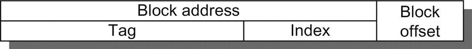

# 四个内存层次的问题

我们继续介绍缓存，回答关于内存层次结构第一层的四个常见问题：

* Q1: 块可以放在上一级的什么地方？(块放置)&#x20;
* Q2: 如果一个块在上一级，如何找到它？(块识别)&#x20;
* Q3: 在未命中的情况下，应该替换哪个块？(块替换)&#x20;
* Q4: 写入时发生什么？(写策略)

对这些问题的回答有助于我们理解层次结构中不同层次内存的不同权衡；因此，我们对每一个例子都要问这四个问题。

Q1:块可以放在上一级的什么地方？

图B.2显示，对块放置位置的限制创造了三种类型的缓存组织：

*   如果每个块在缓存中只有一个地方可以映射，那么缓存就被称为直接映射。这种映射通常是：

    (块地址) MOD (_缓存中块的个数_)，MOD是取模操作。
* 如果一个块可以放在缓存的任何地方，那么这个缓存就可以说是全相联的。
* 如果一个块可以被放置在缓存中的某个区域，那么缓存就是组相联的。一个组是缓存中块的集合。一个块首先被映射到一个集合上，然后该块可以被放置在该集合的任何地方。这个集合通常是通过位选择（bit selection）的，也就是说：(块地址) MOD (组的个数)。


如果一个集合中有n个块，那么这个缓存就被称为n路组相联（n-way set associative）。

从直接映射到全相联的缓存范围实际上是一个组相联的连续体。直接映射是单路组相联，而一个有m个块的全相联可以被称为 "m路组相联"。等价地，直接映射可以被认为是有m个集合，而全相联则是只有一个集合。

今天绝大多数的处理器缓存都是直接映射、双路组相联或四路组相联，原因我们很快就会看到。

Q2: 如果一个块在上一级，如何找到它？

缓存在每个块帧上都有一个地址标签（tag），用来表示块地址。每一个可能包含所需信息的缓存块的标签都会被检查，看它是否与来自处理器的块地址相匹配。通常情况下，所有可能的标签都是并行搜索的，因为速度是至关重要的。

必须有一种方法可以判断缓存块是否存在有效信息。最常见的方法是给标签添加一个有效位，以说明这个条目是否包含有效地址。如果该位没有被设置，那么这个地址上就不可能有匹配。

在进行下一个问题之前，让我们探讨一下处理器地址与缓存的关系。图B.3显示了一个地址是如何划分的。第一个划分是在块状地址和块状偏移之间。块帧地址可以进一步划分为标签（tag）字段和索引（index）字段。块偏移字段从块中选择所需的数据，索引字段选择集合，而标签字段则与之比较，以检查是否命中。尽管可以在用地址进行比较（译者注：bit位更多），但没有必要，因为有以下情况：

* 偏移量不应被用于比较，因为整个块要么存在，要么不存在。因此，根据定义，所有块的偏移量都会导致匹配。
* 检查索引是多余的，因为它被用来选择要检查的集合。例如，一个存储在集合0中的地址，其索引字段必须为0，否则就不能存储在集0中；集1必须有一个索引值为1；以此类推。这种优化通过减少缓存标签的bit位宽度来节省硬件和功耗。



如果缓存的总大小保持不变，增加关联性就会增加每组块的数量，从而减少索引的大小，增加标签的大小。也就是说，图B.3中的标签-索引边界随着关联性的增加而向右移动，全相联的缓存没有索引区域。

在未命中的情况下，应该替换哪个块？

当未命中发生时，缓存控制器必须选择一个块来替换所需的数据。直接映射的一个好处是，硬件决策被简化了--事实上，简单到没有选择：只有一个块帧被检查为命中，并且只有那个区块可以被替换。在全相联或组相联放置的情况下，有许多块可以在未命中时选择。有三种主要的策略用于选择要替换的区块：

* 随机--为了统一分配，候选块是随机选择的。一些系统生成伪随机块号以获得可重复的行为，这在调试硬件时特别有用。
* 最近使用最少( Least Recently Used, LRU)--为了尽量避免扔掉即将需要的信息，可以对块的访问进行记录。依靠过去来预测未来，被替换的区块是未使用时间最长的。LRU依靠的是局部性的推论：如果最近使用的区块有可能被再次使用，那么一个很好的处理对象就是最近使用最少的区块。
* 先入先出（_First In, First Out_, FIFO）--由于LRU的计算可能很复杂，可以通过确定最老的块而不是LRU来逼近LRU。

随机替换的一个优点是，它很容易在硬件中建立。随着需要跟踪的块数量增加，LRU实现将变得越来越难以负担，而且通常只是近似的。一个常见的近似方法（通常被称为伪LRU）是为缓存中的每一个块提供一组比特位，每一个比特对应于缓存中的一路（way)（在一个组相联缓存中，一路对应一个bank；在四路组相联缓存中就有四路）。当一个集合被访问时，与包含所需块的某路相对应的位被打开；如果与一个集合相关的所有位都被打开，那么除了最近被打开的位之外，它们被重置。当一个块必须被替换时，处理器从其位被关闭某路中选择一个区块，如果有多个选择，通常是随机的。这近似于LRU，因为被替换的块在最后一次访问集合中的所有区块后就没有被访问过。图B.4显示了LRU、随机和FIFO替换之间的失误率差异。


&#x20;Q4：写入时发生什么？

读取主导了处理器的缓存访问。所有的指令访问都是读，并且大多数指令都不写到内存。附录A中的图A.32和A.33表明，RISC V程序的存储（store）量指令占10%，加载（load）指令占为26%，因此写入量为10%/(100% + 26% + 10%)，即占整个内存流量的7%。在数据缓存流量中，写入量为10%/(26%+10%)，即28%。要使普通情况下的速度变快意味着需要优化缓存的读取，特别是因为处理器传统上要等待读取完成，但不需要等待写入。然而，Amdahl定律（第1.9节）提醒我们，高性能的设计不能忽视写入的速度。

幸运的是，常见的情况也是容易实现快速的情况。在读取和比较标签的同时，可以从高速缓存中读取块，所以一旦有了块地址，就开始读取块。如果读取命中，块请求的部分会立即传递给处理器。如果是未命中，则没有任何好处--但也没有任何坏处，除了在台式机和服务器计算机中更多的功率；只是忽略了读取的值。

这种乐观的态度是不允许用于写的。在检查标签以确定地址是否命中之前，不能开始修改一个块。因为标签检查不能并行进行，所以写的时间通常比读的时间长。另一个复杂性是，处理器还指定了写的大小，通常在1到8字节之间；只有一个块的那部分可以被改变。相比之下，读可以毫无顾忌地访问更多的字节。

写入的策略往往能区分缓存的设计。在向高速缓存写入时，有两种基本的选择：

* Write through-信息被写入缓存中的块_和下一_级内存中的块。
* Write back-信息只写到缓存中的块。修改后的缓存块只有在被替换时才会被写入主内存。

为了减少替换时writing back的频率，通常使用一种叫做dirty bit的功能。这个状态位表示该块是脏的（在高速缓存中被修改过）还是干净的（没有被修改过）。如果它是干净的，那么这个区块就不会被写回，因为与缓存相同的信息会在低一级别内存中找到。

write back和write through都有其优点。在write back的情况下，写入是以缓存的速度进行的，在一个块内的多次写入只需要向低级别的内存写一次。由于一些写操作不进入内存，write back使用较少的内存带宽，使其在多处理器中具有吸引力。由于write back对内存层次结构的其余部分和内存互连的使用比通写少，所以它还能节省功耗，使其对嵌入式应用也具有吸引力。

Write through比回写更容易实现。缓存始终是干净的，所以与write back不同的是，读取未命中永远不会导致写到更低的层次。Write through还有一个优点，就是下一级有最新的数据拷贝，这就简化了数据的一致性。数据一致性对于多处理器和I/O来说是很重要的，我们在第四章和附录D中对此进行了研究。多级缓存使上层缓存的写入更加可行，因为写入只需要传播到下一级，而不是一直传播到主内存。

正如我们将看到的，I/O和多处理器是善变的：他们希望处理器缓存 write back，以减少内存流量，并通过write through来保持缓存与内存层次结构的低层一致。

当处理器在write through过程中必须等待写入完成时，处理器就被说成是写停滞（write stall）。一个常见的减少写停滞的优化是write buffer，它允许处理器在数据被写入缓冲区后立即继续，从而使处理器的执行与内存的更新重叠。我们很快就会看到，即使有写缓冲区，也会出现写停滞。

因为写的时候不需要数据，所以在写未命中的时候有两种选择：

* Write allocate--块在写未命中时被分配，然后是前面的写入命中动作。在这个寻常的选项中，写未命中的行为与读未命中一样。
* No-write allocate--这显然是不寻常的选择，写未命中不影响缓存。相反，该块只在低一级的内存中被修改。

因此，在无写分配的情况下，块会留在缓存之外，直到程序试图读取这些块。但即使是只写的区块，也会在写分配的情况下留在缓存中。我们来看看一个例子。

**示例**：假设一个有许多缓存条目的全相联的write-back式缓存，开始时是空的。下面是五个内存操作的序列（地址在方括号中）。

```
Write Mem[100];
Write Mem[100];
Read Mem[200];
Write Mem[200];
Write Mem[100].
```

当使用no-write allocate与write allocate时，命中和未命中的数量是多少？

**答案**：对于no-write allocate，地址100不在缓存中，写的时候没有分配，所以前两次写的时候会导致未命中。地址200也不在高速缓存中，所以读也是一个未命中。随后对地址200的写是一个命中。最后一次对100的写仍然是一个未命中。no-write allocate的结果是四次未命中和一次命中。

对于write allocate，对100和200的第一次访问是未命中，其余的都是命中，因为100和200都在高速缓存中找到。因此，写分配的结果是两次未命中和三次命中。

无论哪种写未命中策略都可以使用write through或 write back。通常情况下，write-back 式缓存使用write allocate，希望随后对该块的写会被缓存捕获。Write-through写缓存通常使用no-write allocate。其理由是，即使有对该块的后续写操作，这些写操作仍然必须进入低级别的内存，那么有什么好处呢？


