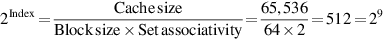
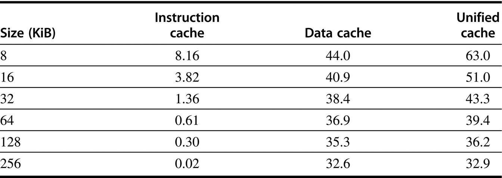

# 一个例子：Opteron的数据缓存

图B.5显示了AMD Opteron微处理器的数据缓存的组织结构。缓存包含65,536(64K)字节的数据，分为64字节的块，具有双路组相联，LRU替换，write-back，以及写未命中时的write allocate 。

让我们通过图B.5中标注的步骤来追踪一个缓存的命中情况（四个步骤用圈起来的数字表示）。 如B.5节所述，Opteron向缓存提交了一个48位的虚拟地址用于标记比较，同时被转换为一个40位的物理地址。

Opteron没有使用全部64位的虚拟地址的原因是它的设计者认为还没有人需要那么多的虚拟地址空间，而且较小的尺寸可以简化Opteron的虚拟地址映射。设计者计划在未来的微处理器中增加虚拟地址。

进入缓存的物理地址分为两个字段：34位块地址和6位块偏移量（64=26，34+6=40）。块地址又被分为地址标签和缓冲区索引。步骤1显示了这种划分。

缓存索引选择要测试的标签，看所需的块是否在缓存中。索引的大小取决于缓冲区的大小，块的大小和集合关联性。对于Opteron高速缓存来说，集合关联性被设置为2，我们计算索引的方法如下。

因此，索引是9位宽，而标签是25（34位减9位）位宽。尽管这是选择合适的块所需要的索引，但64字节的容量远远超过了处理器想要一次性消耗的容量。因此，将缓存内存的数据部分组织成8字节宽更有意义，这也是64位Opteron处理器的自然数据字。因此，除了用9位来索引适当的缓存块外，还有3位来自块偏移量的索引，用于索引适当的8字节。索引选择是图B.5中的第2步。

从高速缓存中读取两个标签（tag）后，将它们与来自处理器的块地址的标签部分进行比较。这种比较是图中的第3步。为了确保标签包含有效信息，有效位必须被设置，否则比较的结果会被忽略。

假设有一个标签确实被匹配上了，最后一步是向处理器发出信号，通过使用2:1多路复用器的获胜输入从高速缓存中加载适当的数据。Opteron允许2个时钟周期来完成这四个步骤，因此，如果接下来的2个时钟周期的指令试图使用加载的结果，它们就会等待。

在Opteron中，处理写比处理读更复杂，在任何缓存中都是如此。如果要写的字在高速缓存中，前三个步骤是一样的。因为Opteron是不按顺序执行的，只有在它发出指令已提交的信号，并且缓存标签比较表明命中后，数据才被写入缓存。

到目前为止，我们已经描述了高速缓存命中的常见情况。在未命中的情况下会发生什么？在读取未命中的情况下，高速缓存向处理器发送一个信号，告诉它数据还不可用，并从下一级的层次结构中读取64字节。读取数据块的前8个字节的延迟是7个时钟周期，其余部分每8个字节的延迟是2个时钟周期。因为数据缓存是设置关联的，所以可以选择替换哪个块。Opteron使用LRU，它选择最久之前被引用的块，所以每次访问必须更新LRU位。替换一个块意味着更新数据、地址标签、有效位和LRU位。

因为Opteron使用write back，旧的数据块可能已经被修改了，因此不能简单地丢弃它。Opteron为每个块保留1个脏位（dirty），以记录该块是否被写入。如果 "受害者 （victim）"被修改了，它的数据和地址将被发送到victim缓冲区。(这个结构类似于其他计算机中的写缓冲区。）Opteron有八个victim块的空间。在与其他缓存动作并行的情况下，它将victim块写到层次结构的下一级。如果victim缓冲区满了，高速缓存必须等待。

写未命中与读未命中非常相似，因为Opteron在读或写失误时都会分配一个块。

我们已经看到了它的工作原理，但是数据缓存不能满足处理器的所有内存需求：处理器也需要指令缓存。尽管一个单一的高速缓存可以尝试提供这两方面的需求，但它可能是一个瓶颈。例如，当一个加载或存储指令被执行时，流水线上的处理器将同时请求一个数据字和一个指令字。因此，单一的高速缓存会给加载和存储带来结构上的危险，导致停滞。征服这个问题的一个简单方法是将其分割：一个缓存专门用于指令，另一个用于数据。在最近的大多数处理器中都有独立的缓存，包括Opteron。因此，它有一个64 KiB的指令缓存以及64 KiB的数据缓存。

处理器知道它发出的是指令地址还是数据地址，因此可以为这两者设置单独的端口，从而使内存层次结构和处理器之间的带宽增加一倍。独立的高速缓存还提供了单独优化每个高速缓存的机会：不同的容量、块大小和关联性可能导致更好的性能。(与Opteron的指令高速缓存和数据高速缓存相比，统一的或混合的术语适用于可以包含指令或数据的高速缓存）。

图B.6显示，指令高速缓存比数据高速缓存的未命中率低。分离指令和数据可以消除由于指令块和数据块之间的冲突而导致的未命中，但是这种分离也固定了用于每种类型的缓存空间。哪个对未命中率更重要？将独立的指令和数据缓冲区与统一的缓冲区进行公平的比较，需要缓冲区的总大小相同。例如，一个独立的16KiB指令缓存和16KiB数据缓存应该和一个32KiB的统一缓存进行比较。计算独立的指令和数据缓冲区的平均未命中率需要知道每个缓冲区的内存引用比例。从附录A的数据中，我们发现分割是100%/(100%+26%+10%)，即74%的指令引用和(26%+10%)/(100%+26%+10%)，大约26%的数据引用。分割对性能的影响超出了未命中率变化所显示的范围，我们很快就会看到这一点。

